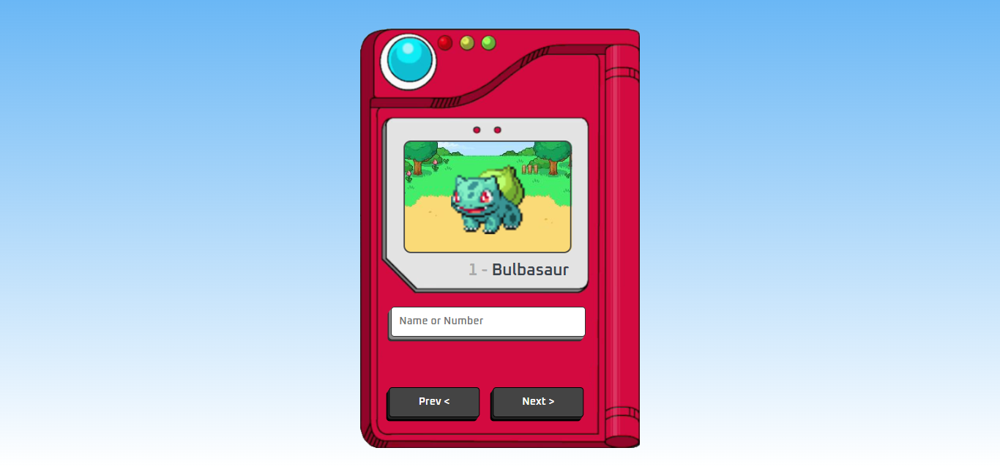

# PokéDex

Este é um projeto simples de uma PokéDex desenvolvido com HTML, JavaScript e a API do PokeAPI. Permite ao usuário pesquisar por Pokémon pelo nome ou número.

## Como Usar

1. Entre na [Pokédex](https://pok-dex-three.vercel.app/).
2. Na barra de pesquisa, digite o nome ou número do Pokémon que deseja pesquisar.
3. Clique no botão e pressione Enter para ver o Pokémon.

## Tecnologias Utilizadas

- HTML
- JavaScript
- [PokeAPI](https://pokeapi.co/)

## Acesse

